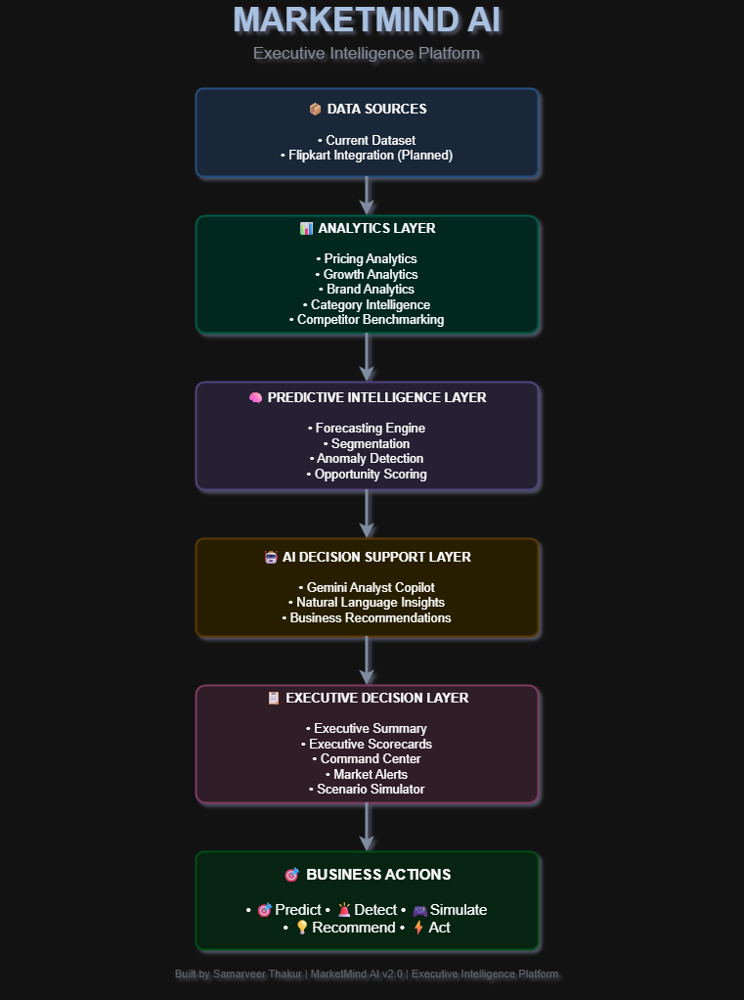

# 🚀 MarketMind AI

### Executive Intelligence Platform for E-commerce Decision Making

**Predict • Detect • Simulate • Recommend • Act**

MarketMind AI is an end-to-end executive intelligence platform designed to transform raw e-commerce data into actionable business decisions. It combines analytics, machine learning, forecasting, AI-powered insights, and decision intelligence into a unified interface built for modern business leaders.

Unlike traditional dashboards that simply visualize historical trends, MarketMind enables organizations to proactively identify opportunities, monitor risks, forecast future scenarios, and simulate strategic decisions before execution.

---

## 🎯 Problem Statement

E-commerce organizations generate massive amounts of data related to products, customer engagement, pricing, reviews, brand performance, and market trends. However, decision-makers often face several challenges:

* Information is scattered across multiple dashboards and reports.
* Insights are reactive rather than predictive.
* Opportunities and risks remain hidden within large datasets.
* Strategic decisions are made without scenario testing.
* Executives lack a unified view of market intelligence.

As a result, businesses struggle to respond quickly to changing market conditions and often miss growth opportunities.

---

## 💡 Solution

MarketMind AI addresses these challenges by providing a centralized executive intelligence platform that integrates:

* Market analytics,
* Machine learning surveillance,
* Predictive forecasting,
* AI-assisted decision support,
* Scenario simulation,
* Opportunity identification, and
* Customer and product intelligence.

The platform empowers decision-makers to move beyond reporting and embrace data-driven decision intelligence.

---

## 🌟 Key Highlights

* 📊 20+ integrated intelligence modules
* 🤖 Gemini-powered AI Analyst Copilot
* 🔮 Forecasting and predictive analytics
* 🚨 Rule-based and ML-driven anomaly detection
* 🎯 Opportunity identification and prioritization
* 🎮 Scenario simulation for strategic planning
* 👥 Customer and product segmentation
* 📈 Executive scorecards and command centers
* 🏆 Competitor and category intelligence
* 🎨 Unified executive-grade user experience

MarketMind AI transforms fragmented information into a single source of truth for executive decision-making.
## ✨ Features

### 📋 Executive Intelligence

Designed for leadership teams and decision-makers, MarketMind provides a unified view of business performance.

* Executive Home Dashboard
* Executive Summary
* Executive KPI Scorecard
* Executive Command Center

---

### 🧠 Market Intelligence

Understand the competitive landscape and uncover hidden opportunities.

* Pricing Analytics
* Growth Analytics
* Brand Analytics
* Market Intelligence
* Category Intelligence
* Competitor Benchmarking
* Opportunity Scoring

---

### 🔮 Predictive Intelligence

Anticipate future trends before they impact the business.

* Forecasting Engine
* Demand Trend Analysis
* Future Review Forecasting
* Price Forecasting

---

### 🎯 Decision Intelligence

Evaluate strategic actions before implementation.

* Portfolio Optimizer
* Scenario Simulator
* Opportunity Engine
* Recommendation Engine

---

### 🤖 AI Intelligence

Leverage Generative AI for executive decision support.

* Gemini-Powered AI Analyst Copilot
* Natural Language Question Answering
* Contextual Business Recommendations

---

### 🚨 Monitoring & Risk Management

Continuously monitor the market for emerging risks and unusual behaviour.

* Rule-Based Anomaly Detection
* ML-Based Anomaly Detection
* Market Alert Center
* Executive Risk Briefs

---

### 👥 Segmentation Intelligence

Understand both products and customers at a deeper level.

* Customer Segmentation
* Product Segmentation
* Persona Discovery
* Segment Profiling

---

## 🏗 System Architecture

MarketMind follows a layered executive intelligence architecture:

```text
                ┌─────────────────────┐
                │   Data Sources      │
                │  (Current Dataset)  │
                │ Flipkart (Planned)  │
                └──────────┬──────────┘
                           ↓
                ┌─────────────────────┐
                │ Analytics Engines   │
                │ Pricing • Growth    │
                │ Brand • Category    │
                └──────────┬──────────┘
                           ↓
                ┌─────────────────────┐
                │ Machine Learning    │
                │ Forecasting         │
                │ Segmentation        │
                │ Anomaly Detection   │
                └──────────┬──────────┘
                           ↓
                ┌─────────────────────┐
                │ Gemini AI Copilot   │
                │ Decision Support    │
                └──────────┬──────────┘
                           ↓
                ┌─────────────────────┐
                │ Executive Dashboards│
                │ Alerts & Insights   │
                └──────────┬──────────┘
                           ↓
                ┌─────────────────────┐
                │ Business Decisions  │
                └─────────────────────┘

## 🏗 Architecture Diagram


```

---

## 🛠 Technology Stack

### Frontend

* Streamlit
* Plotly

### Backend

* Python
* Pandas
* NumPy

### Machine Learning

* Scikit-Learn

### Artificial Intelligence

* Google Gemini 2.5 Flash

### Data Processing

* Python Data Pipelines
* Custom Analytics Engines

### Visualization

* Plotly Express
* Executive UI Components

---

## 📂 Project Structure

```text
MarketMind/
│
├── README.md
├── requirements.txt
├── .gitignore
│
└── backend/
    │
    ├── dashboard.py
    ├── theme.py
    ├── ui_components.py
    ├── ai_copilot.py
    │
    ├── analytics_function.py
    ├── forecasting.py
    ├── recommendation_engine.py
    ├── opportunity_engine.py
    ├── executive_scorecard.py
    ├── category_intelligence.py
    ├── competitor_benchmark.py
    ├── portfolio_optimizer.py
    ├── customer_segmentation.py
    ├── product_segmentation.py
    ├── anomaly_detection.py
    ├── anomaly_detection_ml.py
    ├── market_alerts.py
    ├── scenario_simulator.py
    │
    └── pages/
        ├── Pricing Analytics
        ├── Growth Analytics
        ├── Brand Analytics
        ├── Market Intelligence
        ├── Executive Summary
        ├── Forecasting Engine
        ├── AI Copilot
        ├── Category Intelligence
        ├── Portfolio Optimizer
        ├── Anomaly Detection
        ├── Opportunity Scoring
        ├── Competitor Benchmarking
        ├── Executive Scorecard
        ├── Product Segmentation
        ├── Scenario Simulator
        ├── Customer Segmentation
        ├── ML Anomaly Detection
        ├── Market Alerts
        └── Executive Command Center
```
## ⚙️ Installation & Setup

### Clone the Repository

```bash
git clone https://github.com/<your-username>/MarketMind.git
cd MarketMind
```

### Create a Virtual Environment (Optional but Recommended)

#### Windows

```bash
python -m venv venv
venv\Scripts\activate
```

#### macOS / Linux

```bash
python3 -m venv venv
source venv/bin/activate
```

### Install Dependencies

```bash
pip install -r requirements.txt
```

### Configure Environment Variables

Create a `.env` file in the project root:

```env
GEMINI_API_KEY=your_api_key_here
```

> **Note:** Never commit your API keys to GitHub.

---

## ▶️ Running the Application

Launch MarketMind using:

```bash
streamlit run backend/dashboard.py
```

The application will open in your browser, typically at:

```text
http://localhost:8501
```

---

## 📸 Screenshots

The following screenshots can be added to showcase the platform:

### 🏠 MarketMind Home

* Executive Snapshot
* Market Performance
* Opportunity Explorer

### 🎯 Executive Command Center

* Alerts
* Risks
* Opportunities
* Forecasts

### 🤖 AI Analyst Copilot

* Natural language business insights
* Gemini-powered recommendations

### 🎮 Scenario Simulator

* Pricing simulations
* Rating improvement analysis
* Marketing growth impact

### 🚨 ML Surveillance

* Anomaly detection
* Product surveillance matrix

> Add screenshots inside a `screenshots/` folder and reference them here.

---

## 🔮 Future Scope

MarketMind is designed as an extensible executive intelligence platform.

### 📡 Live Data Integration

Planned enhancements include:

* Flipkart Integration
* Automated Data Ingestion Pipeline
* Real-Time Market Updates

### 🤖 Advanced AI Capabilities

Future AI enhancements include:

* LangChain Agent
* Tool Calling
* Context-Aware AI Assistance

### 🔔 Automation

Operational intelligence enhancements:

* Scheduled Executive Reports
* Automated Alert Delivery
* n8n Workflow Integration

### 📊 Data Intelligence

Advanced analytical capabilities:

* Automated Exploratory Data Analysis (EDA)
* Data Profiling
* Retrieval-Augmented Generation (RAG) Assistant

---

## 👨‍💻 Author

**Samarveer Thakur**

Built as an end-to-end executive intelligence platform demonstrating the integration of analytics, machine learning, forecasting, AI, and decision intelligence for e-commerce use cases.

---

## 🙏 Acknowledgements

This project leverages several open-source technologies and APIs, including:

* Streamlit
* Plotly
* Pandas
* NumPy
* Scikit-Learn
* Google Gemini

Special thanks to the developer communities that make rapid experimentation and innovation possible.

---

## ⭐ Support

If you found this project interesting or useful:

* Consider starring the repository.
* Share feedback and suggestions.
* Connect for discussions around analytics, machine learning, and AI-driven decision systems.

---

# MarketMind AI

### Predict • Detect • Simulate • Recommend • Act

Transforming data into executive decisions.
