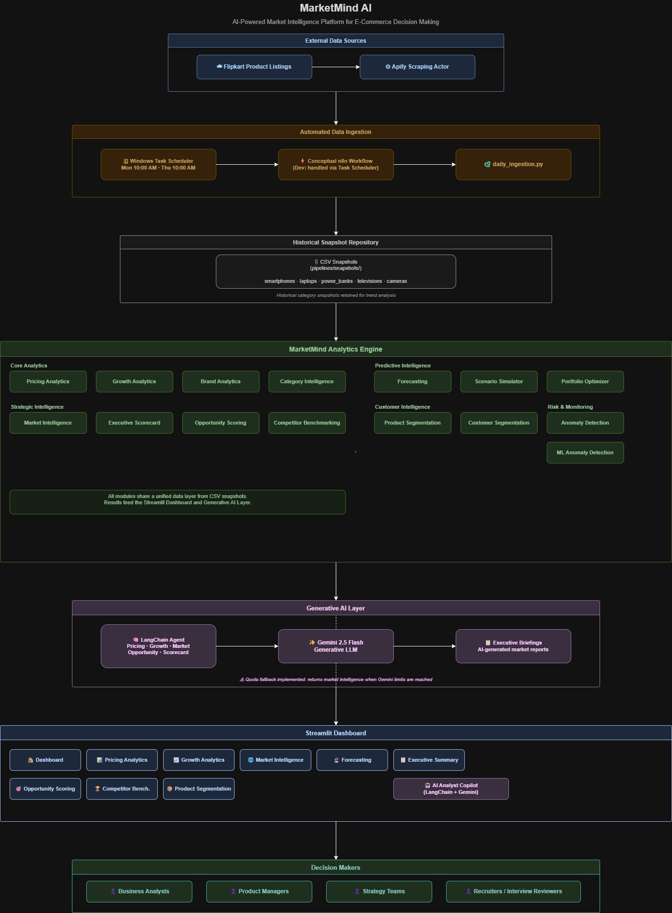
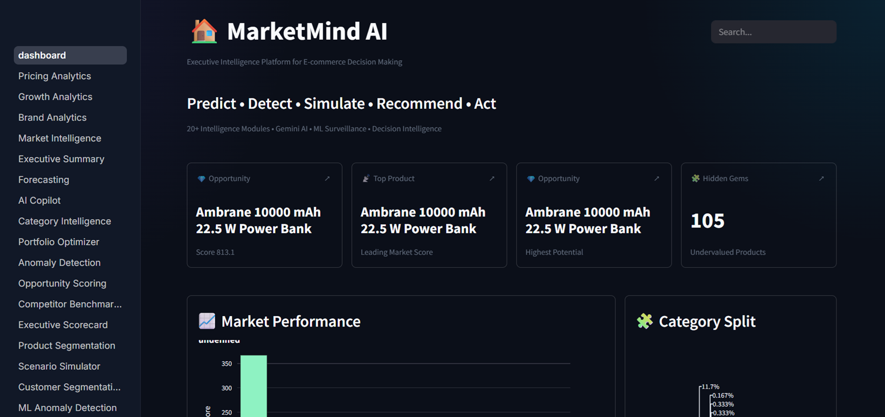
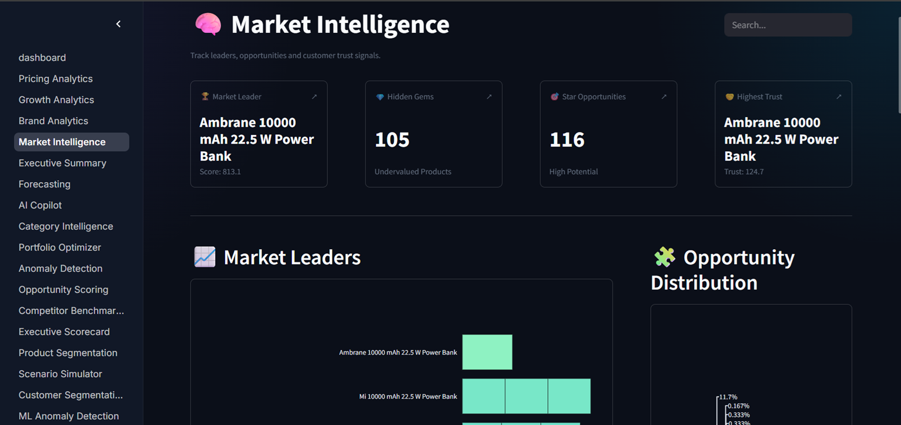
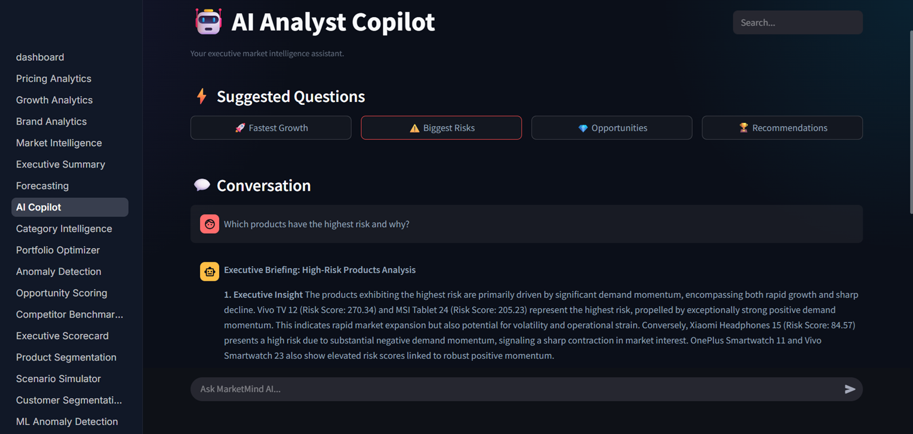
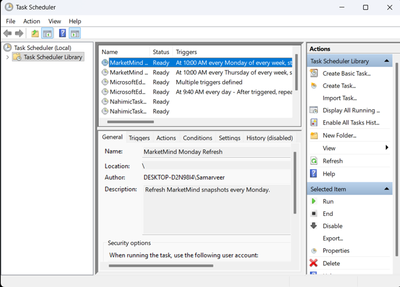
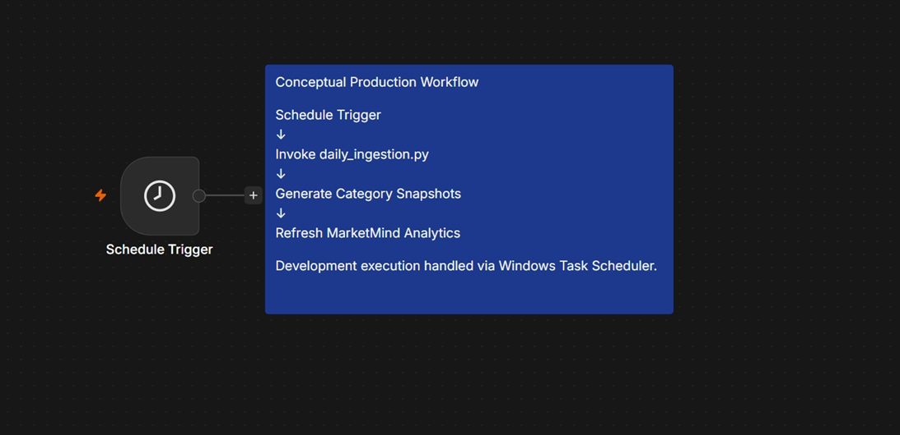

## Live Demo

https://marketmind-ai-samar.streamlit.app

Explore the deployed executive intelligence platform here.
# 🚀 MarketMind AI

### AI-Powered Executive Market Intelligence Platform for E-Commerce Decision Making

MarketMind AI is an end-to-end executive intelligence platform designed to transform raw e-commerce product data into actionable business insights.

The platform combines automated data ingestion, advanced analytics, anomaly detection, forecasting, generative AI, and executive dashboards to help decision-makers identify opportunities, monitor risks, and optimize strategy.

---

## 🎯 Project Objective

Traditional analytics dashboards focus on reporting historical metrics.

MarketMind AI goes beyond reporting by enabling users to:

- Predict future trends
- Detect anomalies automatically
- Identify hidden opportunities
- Benchmark competitors
- Segment customers and products
- Simulate strategic scenarios
- Generate AI-powered executive briefings

---

# ✨ Key Features

## 📈 Executive Intelligence Modules

### Market Analytics

- Pricing Analytics
- Growth Analytics
- Brand Analytics
- Market Intelligence
- Executive Summary

### Predictive Intelligence

- Forecasting
- Forecasting V2
- Portfolio Optimizer
- Scenario Simulator

### Opportunity Discovery

- Opportunity Scoring
- Product Segmentation
- Hidden Gems Detection

### Risk & Monitoring

- Anomaly Detection
- ML Anomaly Detection
- Market Alerts

### Strategic Intelligence

- Competitor Benchmarking
- Executive Scorecard
- Category Intelligence

### Customer Intelligence

- Customer Segmentation

### Generative AI

- AI Analyst Copilot
- Executive Briefings
- Natural Language Market Queries

---

# 🧠 AI Analyst Copilot

MarketMind AI integrates Gemini and LangChain to enable conversational market intelligence.

Users can ask questions such as:

- Which products have the highest risk and why?
- What categories show the strongest growth momentum?
- Which hidden gems should executives prioritize?
- Summarize this week's market intelligence.
- What products represent the biggest opportunities?

The Copilot converts analytics outputs into executive-ready insights.

---

# 🔄 Automated Data Pipeline

MarketMind AI continuously refreshes market snapshots using automated ingestion workflows.

## Data Sources

- Flipkart Product Listings
- Apify Scraping Actor

## Pipeline Flow

Flipkart Listings

↓

Apify Actor

↓

daily_ingestion.py (runs on GitHub Actions, not a personal PC)

↓

Supabase (`flipkart_snapshots` table) — single source of truth, read by every page

↓ (local CSV backup written alongside, for audit/debugging only)

Analytics Engine

↓

AI Layer

↓

Executive Dashboards

---

# ⏰ Automation

## GitHub Actions (Implemented)

Ingestion runs on GitHub's own cloud runners via [`.github/workflows/refresh_data.yml`](.github/workflows/refresh_data.yml) — not on a personal PC, so it keeps running (and keeps Supabase, and therefore the deployed app, live) whether or not anyone's machine is on.

Configured schedule:

- Every Monday at 03:00 UTC
- Every Thursday at 03:00 UTC

Plus a manual `workflow_dispatch` trigger from the Actions tab for on-demand runs.

Responsibilities:

- Scrape every category via the Apify actor
- Upsert results into Supabase (`flipkart_snapshots`), keyed on `(item_id, snapshot_date)` so re-runs update rather than duplicate
- Write a local CSV backup and upload it as a short-lived build artifact
- Exit non-zero (visible as a failed run) if every category fails, rather than silently "succeeding" with no data

Requires `APIFY_TOKEN`, `ACTOR_ID`, `SUPABASE_URL`, `SUPABASE_KEY` as GitHub Actions repository secrets.

`refresh_snapshots.bat` (Windows Task Scheduler) still works as a manual local trigger for development, but is no longer the thing anything actually depends on for live data — see [Refreshing Market Snapshots](#-refreshing-market-snapshots) below.

---

## n8n Workflow (Early Design Exploration)

Before settling on GitHub Actions, a conceptual n8n workflow was sketched out to explore what a fully-managed automation platform would look like for this pipeline. It was never wired up to anything and isn't part of the running system — kept here as a record of an alternative considered, not a currently-active path.

Workflow (as designed, never implemented):

Schedule Trigger

↓

Invoke daily_ingestion.py

↓

Generate Category Snapshots

↓

Refresh MarketMind Analytics

---

# 🏗️ System Architecture



The architecture integrates:

- Automated ingestion pipelines
- Historical snapshot storage
- Executive analytics modules
- Gemini-powered AI layer
- Streamlit dashboards
- Business decision support workflows

---

# 📸 Screenshots

## Dashboard



---

## Market Intelligence



---

## AI Analyst Copilot



---

## Windows Task Scheduler Automation



---

## n8n Workflow Documentation



---

# 📂 Project Structure

```
MarketMind AI
│
├── .github/
│   └── workflows/
│       └── refresh_data.yml   -- scheduled + manual ingestion (see Automation)
│
├── analytics/
│   ├── charts/
│   └── reports/
│
├── architecture/
│   ├── MarketMind_Architecture.drawio
│   └── MarketMind_Architecture.png
│
├── backend/
│   ├── dashboard.py
│   ├── ai_copilot.py
│   ├── daily_ingestion.py     -- scrapes via Apify, upserts into Supabase
│   ├── providers/             -- shared data-access layer (mock + supabase)
│   └── pages/
│
├── db/
│   └── schema.sql             -- Supabase schema (flipkart_snapshots table)
│
├── docs/
│   └── screenshots/
│
├── pipelines/
│   └── snapshots/             -- local CSV backups written by each ingestion run
│
├── refresh_snapshots.bat      -- manual local trigger (dev only, see Automation)
│
└── README.md
```

---

# ⚙️ Installation

## Clone Repository

```bash
git clone https://github.com/Samarveer1285/marketmind-ai.git
cd marketmind-ai
```

---

## Create Virtual Environment

```bash
python -m venv venv
```

Activate:

### Windows

```bash
venv\Scripts\activate
```

---

## Install Dependencies

```bash
pip install -r requirements.txt
```

---

# 🔐 Environment Variables

Create a `.env` file:

```env
APIFY_TOKEN=your_apify_token
ACTOR_ID=your_apify_actor_id
GEMINI_API_KEY=your_gemini_api_key
SUPABASE_URL=your_supabase_project_url
SUPABASE_KEY=your_supabase_key
```

`SUPABASE_URL`/`SUPABASE_KEY` are required for the app to read live data (via `providers/`) and for `daily_ingestion.py` to write it. `APIFY_TOKEN`/`ACTOR_ID` are only needed to run ingestion itself, not to browse the dashboard. The same four values need to also be set as GitHub Actions repository secrets (Settings → Secrets and variables → Actions) for the scheduled workflow, and as Streamlit Cloud "Secrets" (`SUPABASE_URL`/`SUPABASE_KEY`/`GEMINI_API_KEY` only) for the deployed app -- three separate secret stores that all need matching values.

---

# ▶️ Running MarketMind AI

Launch Streamlit:

```bash
streamlit run backend/dashboard.py
```

Open:

```
http://localhost:8501
```

---

# 🔄 Refreshing Market Snapshots

Live data refreshes automatically, twice weekly, via [GitHub Actions](#-automation) — no manual step is needed for the deployed app to stay current.

For a manual/local run (e.g. during development):

```bash
python backend/daily_ingestion.py
```

OR

```bash
refresh_snapshots.bat
```

Either way, results are upserted into Supabase (read by every page) and a local CSV backup is written to `pipelines/snapshots/`.

---

# 📊 Historical Snapshot Repository

MarketMind maintains historical category snapshots for trend analysis, stored in Supabase (`flipkart_snapshots`) and read by every page through the shared `providers/` layer.

Categories include:

- Smartphones
- Gaming Laptops
- Tablets
- Bluetooth Speakers
- Computer Monitors
- Headphones
- Smartwatches
- Televisions
- Cameras
- Power Banks

Snapshots enable:

- Trend tracking
- Growth analysis
- Forecasting
- Opportunity detection
- Risk monitoring

---

# 🛠️ Technology Stack

## Frontend

- Streamlit

## Backend

- Python

## Data Processing

- Pandas
- NumPy

## Visualization

- Plotly
- Matplotlib

## Machine Learning

- Scikit-learn

## Forecasting

- Statistical Forecasting Models

## Generative AI

- Gemini
- LangChain

## Database

- Supabase (Postgres)

## Automation

- GitHub Actions (scheduled + manually-triggered ingestion)

## Data Acquisition

- Apify
- Flipkart

## Version Control

- Git
- GitHub

---

# 🚀 Future Enhancements

Potential future improvements include:

- Cloud deployment
- Docker containerization
- CI/CD pipelines
- Production n8n execution
- Multi-marketplace intelligence
- Real-time streaming ingestion
- Role-based access control

---

# 👨‍💻 Author

**Samarveer Thakur**

Built as an executive intelligence platform demonstrating the integration of analytics, machine learning, automation, and generative AI for strategic decision-making.

---

## ⭐ If you found this project interesting, consider starring the repository.
